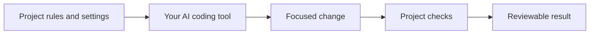

<p align="center">
  
</p>
<h1 align="center">tack</h1>
<p align="center"><strong>Give your AI coding tools a shared way to work.</strong></p>
<p align="center">Your conventions. Your project context. Your checks. For solo developers and teams.</p>
<p align="center">
  <a href="https://github.com/nbfrodri/agent-tack/actions/workflows/ci.yml"></a>
  <a href="LICENSE"></a>
  <a href="docs/editors.md"></a>
  
</p>
<p align="center">
  <a href="#quick-start">Quick start</a> &middot;
  <a href="docs/sharing.md">Team walkthrough</a> &middot;
  <a href="docs/README.md">Documentation</a> &middot;
  <a href="docs/results.md">Results</a>
</p>

---

**Your next AI session should not need the same project briefing.** tack turns your development preferences into reusable project guidance: how to make changes, where context belongs and what to check before calling the work done. Keep it personal, commit a shared setup for your team, or customize a fork across projects.

It works around your existing coding agent. It does not provide a model or replace your test framework.

Use tack when portable preferences and project coordination solve a real problem. If a short `AGENTS.md` and your existing CI already do the job, that simpler setup may be enough. Our [benchmarks](docs/results.md) include cases where tack costs more without better code.

## What you get

| Agree once | Carry context forward | Make verification visible |
| --- | --- | --- |
| Share conventions and preferences in Git instead of repeating them in every prompt. | Give the next session the same architecture, plan and handoff locations. | Run the project's real checks and see failures, timeouts and work that still needs review. |



Ask for the change: **"Fix the checkout bug"** or **"Add CSV export."** Tack guides the assistant through work sized to the risk, meaningful tests, maintainable design and a reviewable Git history. TDD, pragmatic SOLID and documentation upkeep remain part of that guidance; executable checks provide narrower guarantees. [Engineering practices](docs/engineering-practices.md).

The default catalog is just workflow and onboarding; specialist skills and roles are opt-in. Add procedures when they solve a real problem. [Installation choices](docs/installation.md) | [Why this direction](docs/why.md).

## Quick start

Requires Git, Bash 3.2+ and Python 3.9+. Linux, macOS and Windows options are described in [tool and platform support](docs/editors.md).

```bash
# Keep this checkout: installed files link to it.
git clone https://github.com/nbfrodri/agent-tack.git ~/Projects/agent-tack
~/Projects/agent-tack/install.sh

cd ~/Projects/my-app
tack enable       # local to this clone; adds no project files
tack setup        # inspect existing tools and guidance; runs no project code
```

Start a new AI session and ask:

> Configure tack for this project. Reuse the existing conventions and docs. Propose useful additions and let me choose what to create.

Use `tack enable --scaffold` if you want the missing base guidance files. Review commands with `tack verify --plan`, then grant local execution trust with `tack trust` when you are ready to run them. [Full setup guide](docs/setup.md).

## Use it your way

| Your situation | Start here |
| --- | --- |
| Personal project | Enable your clone, choose preferences locally and work normally. No shared profile required. |
| Several developers on one project | Commit `.tack`, `tack.json`, project guidance and useful check maps. Each clone keeps its own trust and overrides. |
| Custom defaults across several projects | Maintain a personal or team fork and install from it. [How forks work](docs/sharing.md#use-a-fork-for-deeper-customization). |

```bash
# Optional shared defaults for one repository
tack enable --shared
tack mode auto --shared
tack config reply-style brief --shared
tack config collaboration team --shared
```

Leave `auto` as the usual mode: a small fix and a risky migration need different levels of work. Say "use strict for this task" when needed; that need not change the saved default. [Daily use](docs/usage.md) | [End-to-end team example](docs/sharing.md).

Your project stays portable: the shared setup is ordinary files in Git, and you can [disable tack or tidy old records](docs/leaving.md) without deleting useful project knowledge.

Working on backend and frontend in parallel? Share canonical contracts and run declared checks against a prospective merge with `tack team --verify --against REF`, before changing your branch. New collaborators can use a pinned setup command. [Team workflow and limits](docs/teamwork.md).

## Tools and checks

Claude Code, Codex, Gemini CLI, GitHub Copilot, OpenCode, Crush and Cursor receive the integrations they support. Git hooks are shared; native agent and runtime hook coverage varies. [Support matrix and setup](docs/editors.md).

`tack verify` selects existing checks from changed paths; `tack verify --all` also checks a clean clone or completed integration. An optional `checks-map.json` maps code areas to commands. Results expose failures, timeouts and unmapped work. [Verification guide](docs/verification.md).

Already happy with your project guidance? [Run only the CLI checks](docs/verification.md#use-the-checks-without-installing-ai-guidance), without installing global instructions, skills or hooks.

## What the evidence says

The small-core comparison completed **24 development sessions and eight blind code reviews**. The short guide and small core each passed acceptance in 8/8 deliveries, but both still had defects outside those checks. Mean code-quality grades did not improve. Compared with the guide, the core cost **61.9% more time / 67.6% more input tokens with Luna**, and **5.0% more time / 25.4% more input with Sol**. [Complete results](docs/benchmarks/2026-10-09-lean-core.md).

The earlier [full lifecycle study](docs/benchmarks/2026-10-08-lifecycle-value.md) also found higher cost without a general quality advantage. Tack's concrete checks can detect configuration drift and incompatible prospective merges; broader savings remain unproven. Enable what earns its cost in your project. [All results](docs/results.md) | [Direction](docs/adr/0003-project-verification-over-generic-process.md).

## Learn more

| I want to... | Guide |
| --- | --- |
| Install and enable tack | [Setup](docs/setup.md) |
| Work with it every day | [Usage](docs/usage.md) |
| Share it or customize a fork | [Sharing](docs/sharing.md) |
| Change settings and context locations | [Configuration](docs/configuration.md) |
| Add selected external skills | [External skills](docs/external-skills.md) |
| Understand the implementation | [Architecture](docs/architecture.md) |

[All documentation](docs/README.md) includes optional features, engineering practices, installation details and benchmark history.

## Contributing

Useful contributions include reproducible bugs, better adapters, checks that catch real failures and honest benchmarks. Read [AGENTS.md](AGENTS.md) and [Development](docs/development.md); use the issue forms and PR template.

```bash
tests/validate.sh
tests/lint.sh
tests/run-all.sh -j 4
```

Tests use temporary homes and repositories. Code and original project assets use the [MIT license](LICENSE).
