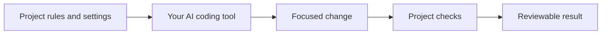

<p align="center">
  
</p>
<h1 align="center">tack</h1>
<p align="center"><strong>Your way of developing with AI. Consistent across projects and tools.</strong></p>
<p align="center">Conventions, useful context and real project checks for you or your team.</p>
<p align="center">
  <a href="https://github.com/nbfrodri/agent-tack/actions/workflows/ci.yml"></a>
  <a href="LICENSE"></a>
  <a href="docs/editors.md"></a>
  
</p>
<p align="center">
  <a href="#quick-start">Quick start</a> &middot;
  <a href="docs/sharing.md">Team walkthrough</a> &middot;
  <a href="docs/README.md">Documentation</a> &middot;
  <a href="docs/results.md">Results</a>
</p>

---

**Set up how you want AI to work, then keep that setup with your code.** tack helps the assistant follow project conventions, find useful context, save work in agreed places and run relevant checks. Use it locally for yourself, share it with teammates or customize a fork for several projects.

It works around your existing coding agent. It does not provide a model or replace your test framework.

## What you get

| Agree once | Find the right context | Check the work |
| --- | --- | --- |
| Keep project rules in `AGENTS.md` and shared preferences in `tack.json`. | Link architecture, plans and handoffs in the places your project uses. | Run existing commands for changed files and see failures or missing checks. |



Skills and specialist roles are optional tools for a demonstrated need. More instructions or agents are not an outcome in themselves. [Why this direction](docs/why.md).

## Quick start

Requires Git, Bash 3.2+ and Python 3.9+. Linux, macOS and Windows options are described in [tool and platform support](docs/editors.md).

```bash
# Keep this checkout: installed files link to it.
git clone https://github.com/nbfrodri/agent-tack.git ~/Projects/agent-tack
~/Projects/agent-tack/install.sh

cd ~/Projects/my-app
tack enable       # local to this clone; adds no project files
tack setup        # inspect existing tools and guidance; runs no project code
```

Start a new AI session and ask:

> Configure tack for this project. Reuse the existing conventions and docs. Propose useful additions and let me choose what to create.

Use `tack enable --scaffold` if you want the missing base guidance files. Review commands with `tack verify --plan`, then grant local execution trust with `tack trust` when you are ready to run them. [Full setup guide](docs/setup.md).

## Use it your way

| Your situation | Start here |
| --- | --- |
| Personal project | Enable your clone, choose preferences locally and work normally. No shared profile required. |
| Several developers on one project | Commit `.tack`, `tack.json`, project guidance and useful check maps. Each clone keeps its own trust and overrides. |
| Custom defaults across several projects | Maintain a personal or team fork and install from it. [How forks work](docs/sharing.md#use-a-fork-for-deeper-customization). |

```bash
# Optional shared defaults for one repository
tack enable --shared
tack mode auto --shared
tack config reply-style brief --shared
```

Leave `auto` as the usual mode: a small fix and a risky migration need different levels of work. Say "use strict for this task" when needed; that need not change the saved default. [Daily use](docs/usage.md) | [End-to-end team example](docs/sharing.md).

## Tools and checks

Claude Code, Codex, Gemini CLI, GitHub Copilot, OpenCode, Crush and Cursor receive the integrations they support. Git hooks are shared; native agent and runtime hook coverage varies. [Support matrix and setup](docs/editors.md).

`tack verify` selects existing checks from changed paths. An optional `checks-map.json` maps areas of your code to commands. It reports failed, timed-out and unmapped work; it does not silently treat missing checks as success. [Verification guide](docs/verification.md).

## What the evidence says

The latest Codex adoption comparison completed 24 sessions: **8/8 code tasks passed with tack and 8/8 with native project guidance**. Shared mode, context paths and reply style reached all four teammate clones, with trust kept local. Tack took about **2x the total session time**.

Both conditions used the same engineering requirements and wrote useful regression tests. We do not claim a general code-quality or cost improvement. [Adoption results and limits](docs/benchmarks/2026-10-08-adoption.md) | [All results](docs/results.md) | [Decision](docs/adr/0003-project-verification-over-generic-process.md).

## Learn more

| I want to... | Guide |
| --- | --- |
| Install and enable tack | [Setup](docs/setup.md) |
| Work with it every day | [Usage](docs/usage.md) |
| Share it or customize a fork | [Sharing](docs/sharing.md) |
| Change settings and context locations | [Configuration](docs/configuration.md) |
| Add selected external skills | [External skills](docs/external-skills.md) |
| Understand the implementation | [Architecture](docs/architecture.md) |

[All documentation](docs/README.md) includes optional features, engineering practices, installation details and benchmark history.

## Contributing

Useful contributions include reproducible bugs, better adapters, checks that catch real failures and honest benchmarks. Read [AGENTS.md](AGENTS.md) and [Development](docs/development.md); use the issue forms and PR template.

```bash
tests/validate.sh
tests/lint.sh
tests/run-all.sh -j 4
```

Tests use temporary homes and repositories. Code and original project assets use the [MIT license](LICENSE).
