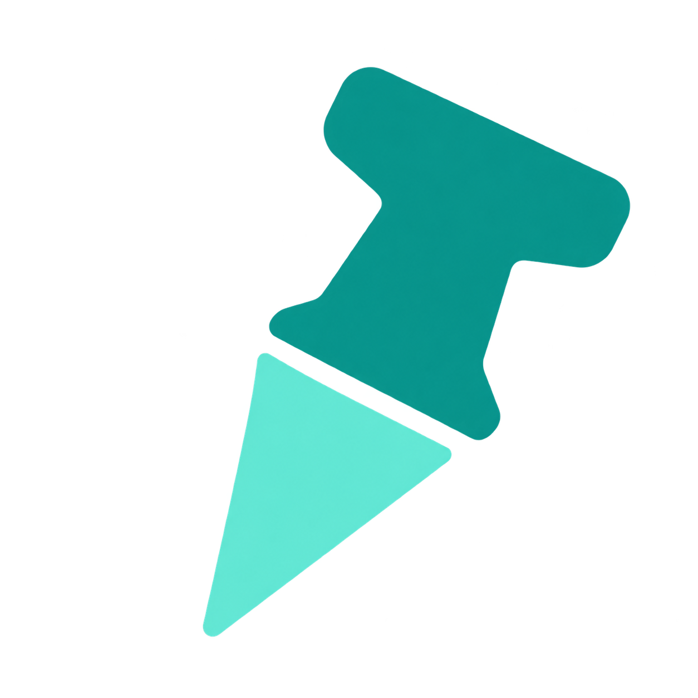
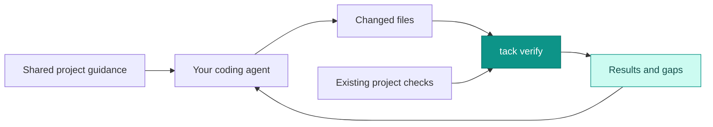

<p align="center">
  
</p>
<h1 align="center">tack</h1>
<p align="center"><strong>Your team's way of working. Across AI coding tools.</strong></p>
<p align="center">Shared conventions, organized context and concrete project checks.</p>
<p align="center">
  <a href="https://github.com/nbfrodri/agent-tack/actions/workflows/ci.yml"></a>
  <a href="LICENSE"></a>
  
  
</p>
<p align="center">
  <a href="#quick-start">Quick start</a> ·
  <a href="#example-a-team-building-with-ai">Team example</a> ·
  <a href="#see-it-work">See it work</a> ·
  <a href="#tool-support">Tool support</a> ·
  <a href="#measured-results">Results</a> ·
  <a href="#contributing">Contribute</a>
</p>

---

**Define how your team develops with AI, then share that setup.** tack keeps conventions, context entrypoints, artifact locations and useful checks in versioned files that travel across supported coding tools. Start from existing project guidance, adapt it with the assistant, and review it like code.

> [!NOTE]
> **A change in focus.** Our benchmarks found that more process did not consistently produce better code. tack is moving toward less generic instruction and more concrete project verification. Skills, agents and documents should solve a demonstrated need. [Read the decision](docs/adr/0003-project-verification-over-generic-process.md) · [See the evidence](docs/results.md)

## What tack brings

| Align the team | Organize the context | Verify the change |
| :--- | :--- | :--- |
| Share coding conventions, useful procedures and workflow expectations across tools and teammates. | Agree where instructions, architecture, decisions and handoffs live, and when to read them. Reuse the project's layout. | Select existing tests, type checks or domain checks from changed paths. See failures and unmapped files before handoff. |

**The goal:** fewer faulty deliveries and less repeated setup, at a measured time/token cost. Shared instructions align a team; they do not guarantee identical behavior from every model or tool.

## Quick start

**Requirements:** Git, Bash 3.2+ and Python 3. Linux and macOS are supported; Windows can use WSL2 or native Git Bash. Native Windows installation/restoration and verification have dedicated tests; AI tool behavior still varies by integration. [Platform details](docs/editors.md#windows).

```bash
# Keep this checkout: installed files link to it.
git clone https://github.com/nbfrodri/agent-tack.git ~/Projects/agent-tack
~/Projects/agent-tack/install.sh

# Opt a project into tack.
cd ~/Projects/my-app
tack enable
```

Restart the AI tool, then work normally. Use `tack doctor` to inspect the installation.

| When you want to… | Use |
| --- | --- |
| Preview installation changes | `./install.sh --dry-run` |
| Share activation with teammates | `tack enable --shared` |
| Create four base guidance files | `tack enable --scaffold` |
| Inspect optional project setup | `tack setup` |
| Review selected checks without executing | `tack verify --plan` |
| Allow local project commands, after review | `tack trust` |
| Run selected checks | `tack verify` |
| Disable workflow guidance in this project | `tack disable` |

Plain activation creates no guidance files. Scaffolding creates missing `AGENTS.md`, `CLAUDE.md`, `docs/architecture.md` and `docs-map.txt`; it never overwrites them. During initialization, the assistant proposes useful optional additions and remembers your choices. It does not create a catalog of empty skills or agents. [Setup details](docs/usage.md#project-initialization).

### Set up a shared way of working

Ask your assistant:

> Set up tack for this repository and our team. Inspect what already exists. Propose the conventions, context entrypoints, locations for useful work artifacts and verification commands we should share. Ask only about unresolved choices, then apply the agreed setup.

| Agree once | Record it in |
| --- | --- |
| Coding, testing, review and Git conventions | Project `AGENTS.md`, linking detailed guides where needed |
| What context matters and where work is saved | A short index in `AGENTS.md`; architecture, decisions and handoffs in the agreed project locations |
| Commands that verify a change | Existing test/CI configuration and optional `checks-map.json` |
| Procedures or specialist roles worth reusing | Project skills and role definitions, indexed from `AGENTS.md` |

Commit the agreed project files so teammates start from the same foundation. Each teammate installs tack and reviews local execution trust. CLI preferences such as `tack mode` and `tack config` live in local/global Git configuration; **they do not synchronize through a commit**. Document any team defaults explicitly. Setup is currently guided by the assistant, not a single profile wizard. [Team setup and updates](docs/sharing.md).

## Example: a team building with AI

Maya uses Codex and Leo uses Claude Code on the same TypeScript app. They want the same conventions, context locations and checks without repeating the setup in every conversation. This example assumes their app already has working `pnpm lint`, `pnpm typecheck` and `pnpm test` scripts; substitute the commands and paths that exist in your project.

### 1. Maya prepares the shared project setup

Both developers install tack using the quick start above. Maya then starts a setup branch in their app:

```bash
cd ~/Projects/team-app
git switch -c chore/shared-ai-setup
tack enable --shared --scaffold
tack setup
```

She asks her assistant:

> Configure this repository for our team. We use pnpm and TypeScript. Reuse our scripts and CI. Keep shared conventions in AGENTS.md, architecture in docs/architecture.md, and reusable project procedures in .agents/skills/. Use docs/plans/ and docs/handoffs/ only when the work needs them. Propose any additional files before creating them; reuse existing guidance and ask only about missing decisions. Include the verification map and our existing PR template in the review.

The assistant inspects the repo, fills the scaffold from real code and records the agreed choices. A compact project `AGENTS.md` might contain:

```markdown
# Team conventions
- Use pnpm and TypeScript; follow the existing module structure.
- Add regression tests for changed behavior. Reuse existing dependencies.
- Use Conventional Commits and include checks actually run in each PR.
- Read docs/architecture.md when changing component boundaries.
- Save necessary plans in docs/plans/ and resumable handoffs in docs/handoffs/.
- Keep reusable procedures in .agents/skills/ and index them here.
- Keep small fixes free of unnecessary plan or handoff files.

## Checks
- pnpm lint
- pnpm typecheck
- pnpm test
- tack verify selects these checks from checks-map.json.

## Setup choices
- Share activation, base guidance and checks-map.json.
- Reuse .github/pull_request_template.md; no new roles are needed yet.
- Local defaults: auto mode, brief replies, delegation off.
```

Their selected `checks-map.json` connects app changes to those existing commands:

```json
{
  "version": 1,
  "checks": [
    {
      "id": "app-quality",
      "paths": ["src/*", "tests/*", "package.json", "pnpm-lock.yaml", "tsconfig*.json"],
      "command": "pnpm lint && pnpm typecheck && pnpm test",
      "timeout_seconds": 90
    }
  ]
}
```

This deliberately small map covers the example's app paths. Other paths are reported as unmapped; extend it with real checks as the project needs them. `docs-map.txt` separately records which existing docs need review when code changes.

### 2. The team reviews and adopts the setup

Maya reviews the generated files and selected commands:

```bash
tack setup --check
tack verify --plan
git add .tack AGENTS.md CLAUDE.md docs/architecture.md docs-map.txt checks-map.json
git commit -m "chore: share AI development conventions"
```

She opens a PR using the team's existing process. Structural readiness and a verification plan are not passing test results: the team reviews the actual conventions and runs its existing CI before merging.

After that PR merges, Leo pulls the project and both developers apply the agreed **local** preferences in their own clone:

```bash
git switch main
git pull --ff-only
tack mode auto
tack config reply-style brief
tack config delegation off
tack context
tack verify --plan
tack trust                         # after reviewing the project commands
```

They restart their AI sessions. The committed `.tack` shares activation; AGENTS.md shares conventions and the context index; the map shares checks. Trust and CLI preferences remain local. Their editors may supply context differently, but both can inspect it with `tack context` and run the same verification CLI.

`auto` lets the assistant choose the level for each task: a small bug may need lite, a bounded feature standard, and a broad or high-risk change strict. Either developer can request a different level in the conversation without saving a permanent project override.

### 3. Leo implements a real change

Leo asks Claude Code:

> Fix the API validation bug that accepts an empty display name. Follow AGENTS.md, add a regression test, and use the shared verification map. Keep the change small and include the checks and any remaining gaps in the PR.

The assistant reads the agreed entrypoints, creates a task branch, changes the API code and test, and runs:

```bash
tack verify --plan                  # inspect checks selected by the changed paths
tack verify                        # run lint, types and tests from the map
```

A failed check supplies the command and failure output for the assistant to address. A pass reports only the selected checks, with unchanged inputs and no unmapped paths. The assistant then prepares the commit and PR using the team's template. It updates architecture or creates a handoff only if the change needs one. Maya can review the same code and rerun the same checks from Codex.

### 4. Improve the setup through normal PRs

If the team repeatedly needs an API compatibility procedure, add a project skill and index it in AGENTS.md. If migrations need a dedicated check, add a rule for those paths. Review and merge the change once; teammates receive it with the project. Cross-project conventions can move to a shared tack fork when useful. [Team configuration guide](docs/sharing.md).

## See it work



A small, optional `checks-map.json` connects parts of your project to checks you already have:

```json
{
  "version": 1,
  "checks": [
    {
      "id": "api-contract",
      "paths": ["src/api/*", "tests/api/*"],
      "command": "uv run pytest tests/api",
      "timeout_seconds": 60
    }
  ]
}
```

For a Python project with those tests, an illustrative failed run looks like this:

```text
$ tack verify
Verification: failed (2 changed paths)
- api-contract: failed: uv run pytest tests/api (from checks-map.json)
AssertionError: API invariant failed
Selected checks are declared verification, not proof of complete semantic coverage.
```

| Result | Meaning |
| --- | --- |
| `passed` | Selected commands passed, inputs stayed unchanged and no changed path was unmapped. |
| `failed` | A command failed or timed out; the assistant gets the failure output. |
| `incomplete` / `unverified` | Checks are missing, the budget was exhausted or inputs changed during verification. |
| `untrusted` | Project commands were not executed. |
| `no_changes` | No changed paths were found; this is distinct from tests passing. |

Without a map, tack reuses its existing test-command detector or your explicit `check-fast` command and reports uncovered paths. It does not invent semantic tests or silently install a framework. Native completion hooks use mapped verification where available; every tool can use the same CLI. [Configuration, exit codes and limits](docs/usage.md#project-verification).

## Built for a shared repository

```text
my-project/
├── .tack                 shared activation, if selected
├── AGENTS.md             project conventions and capability index
├── checks-map.json       optional checks for changed paths
├── docs-map.txt          source-to-documentation relationships
└── .agents/
    ├── skills/           useful reusable project procedures
    └── agents/           justified specialist role definitions
```

This is an example of selected project files, not a template that tack always generates. Start with existing conventions and tools. Add a skill when it captures a useful reusable procedure, a specialist when a distinct review is needed, and a document when someone needs its information.

**Shared:** project instructions, check definitions, conventions and selected local capabilities.<br>
**Local:** execution trust, credentials, private memory and personal settings.

Teammates install the common tack configuration locally and review changes through normal PRs. tack is repository-based sharing, not a centralized administration service. [Sharing guide](docs/sharing.md) · [Project capabilities](docs/usage.md#project-skills-and-roles).

## Tool support

| Tool | Project guidance and skills | Runtime integration |
| --- | :---: | --- |
| Claude Code | ✓ | Native hooks and roles |
| Codex | ✓ | Shared runtime checks through native adapters |
| Gemini CLI | ✓ | Startup, command and completion adapters |
| GitHub Copilot CLI | ✓ | Startup, command and completion adapters |
| Cursor | ✓* | Command guard; guidance for other steps |
| OpenCode | ✓ | Instructions, native roles and Git hooks |
| Crush | ✓ | Instructions and Git hooks |

Git-level checks work independently of the AI tool. *Cursor's global rules require a one-time paste. Protocol tests and installed formats do not prove identical live behavior in every editor. [Exact capabilities and limitations](docs/editors.md#what-each-tool-receives).

## Safeguards and workflow choices

- **Executable checks:** staged-secret scanning, commit conventions, protected Git operations and runtime checks where supported. The command guard is a safety net, not a sandbox. [Boundaries](docs/how-it-works.md#what-the-command-guard-covers-and-what-it-does-not).
- **Configuration preservation:** installation tracks its changes; reinstall and uninstall preserve independent user edits.
- **Task-scaled guidance:** use the process that fits the task, with optional capabilities loaded for a concrete need.

| Mode | Intended scope | Additional guidance |
| --- | --- | --- |
| `auto` | Default | Selects a level for the task |
| `lite` | Small, bounded, low-risk changes | Useful tests and clean Git work; no plan files or review agents |
| `standard` | A bounded feature or fix | Test-driven work and affected documentation |
| `strict` | Broad or high-impact work | Explicit plan, deeper review and selected delegation |
| `unleash` | User-selected autonomous work | Fewer confirmations within scope; safeguards remain |

```bash
tack mode lite                      # project preference
tack config reply-style brief       # brief, visual or detailed
tack config delegation off          # keep work sequential
```

Existing explicit workflow preferences remain during the transition. [Modes and settings](docs/usage.md#workflow-modes) · [Customization](docs/customization.md).

## Measured results

> [!IMPORTANT]
> **A check runner is not proof of better AI code.** We publish positive, null and adverse results. The new verification increment has local behavior tests; its effect on real model outcomes and cost has not yet been benchmarked.

| Experiment | Plain assistant | tack `auto` | What it shows |
| --- | --- | --- | --- |
| Historical Haiku attachment security, 5 runs per condition | 0/5 pass | 4/5 pass | A gain on this scenario; a later tack batch passed 5/5 |
| Historical Haiku SQL search, 5 runs per condition | 0/5 pass | 0/5 pass | Process did not resolve the missed wildcard behavior |
| Codex Luna + Sol, 3 scenarios, 2 runs per model/condition | 12/12 pass | 12/12 pass | Acceptance parity on the original hidden tests |

In the Codex comparison, tack added useful regression tests with Luna and branch/commit discipline. It also took **2.27x / 2.38x session time** and **4.54x / 3.49x input tokens** for Luna / Sol; most input was cached. A supplementary review found Unicode search failures in both Luna auto outputs. Subscription token counts are not dollar charges. Small samples do not establish a general effect.

[Full results](docs/results.md) · [Codex data and method](docs/benchmarks/2026-10-08-codex.md) · [Code-quality review](docs/benchmarks/2026-10-08-codex-quality.md).

## Direction and roadmap

| Delivered in this increment | Next to measure |
| --- | --- |
| Shared path-based check selection and explicit gaps | Defects caught on held-out real repository tasks |
| Local trust, bounded execution and result reporting | Reduced task time and human rework |
| Focused tasks avoid unrelated onboarding | Smaller, relevant context without missing necessary information |
| Documented sources and negative results | Whether specialist review adds enough value to justify its cost |

**Configuration UX next:** versioned project preferences with local overrides, simpler adoption after cloning, and task-specific mode selection with `auto` as the usual default. A shared `tack config`/`tack mode` file is not implemented yet; the team example above shows the current explicit local setup.

The design borrows ideas about selective checks, bounded context and simple observable execution from other public projects. [Research and adoption decisions](docs/audits/2026-10-08-upstream-design-research.md) · [ADR: the change in focus](docs/adr/0003-project-verification-over-generic-process.md).

## Contributing

Useful contributions include a reproducible bug, a missing tool adapter, a project check with a real failure case, or a benchmark that tests a meaningful limitation. Use the repository's issue forms and PR template; keep claims tied to evidence.

```bash
tests/validate.sh          # content and cross-references
tests/lint.sh              # pinned shell/Python checks
tests/run-all.sh -j 4      # isolated regression suites
```

Tests use temporary homes and repositories. Follow [AGENTS.md](AGENTS.md) for Bash compatibility and repository rules, and [Development](docs/development.md) for dependencies and focused suites. Do not include credentials or private benchmark transcripts in contributions.

## Documentation

| Start here | Go deeper |
| --- | --- |
| [Usage and commands](docs/usage.md) | [Architecture](docs/architecture.md) |
| [Editors and platforms](docs/editors.md) | [How checks work](docs/how-it-works.md) |
| [Sharing configuration](docs/sharing.md) | [Components](docs/components.md) |
| [Why tack](docs/why.md) | [Design decision](docs/adr/0003-project-verification-over-generic-process.md) |
| [Customization](docs/customization.md) | [Benchmarks](docs/results.md) |

<details>
<summary><strong>Is tack an agent or a harness?</strong></summary>

Tack configures and verifies work around existing coding agents. It does not provide a model or its own autonomous agent runtime. “Harness” describes that technical role; **shared configuration and verification layer** is the clearer product description.

</details>

<details>
<summary><strong>Does sharing tack share my credentials or execution trust?</strong></summary>

No. Share selected repository files and common configuration. Each clone grants its own command execution trust. Credentials, private user memory and personal settings should remain outside the shared project.

</details>

<details>
<summary><strong>Can I keep using only my existing checks?</strong></summary>

Yes. A check map names commands you already use; it does not replace your test framework, linter or CI. Without a map, tack retains the canonical-test/explicit-check fallback. Map coverage is only declared routing coverage: missing semantic checks still need to be added to the project.

</details>

## License

Code and original project assets are available under the [MIT license](LICENSE).

---

<p align="center"><strong>Align the team. Verify the work. Keep the overhead honest.</strong></p>
