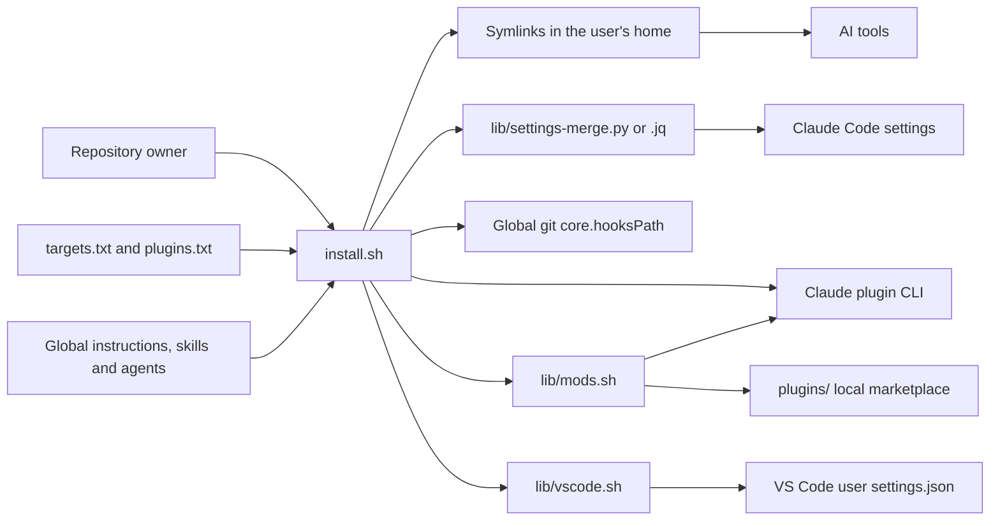
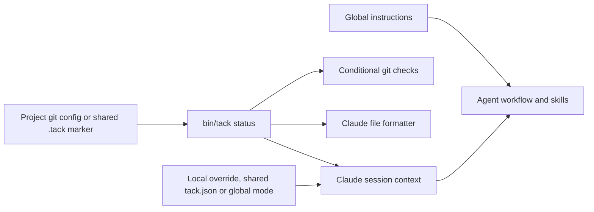

# Architecture

How the repository's components fit together, from installation to an agent session or a git operation. Supported tools and installed paths are listed in [how it works](how-it-works.md).

## Context and installation

Tack is a local collection of instructions and scripts. AI tools read its installed configuration; git and Claude Code invoke its executable hooks.

`install.sh` configures tools, links content, merges settings, installs git hooks, updates plugins, installs mods and enables VS Code's AGENTS.md loading in that order. It counts failures while continuing other steps, then exits non-zero if any step failed. Links point to the checkout, so its location must remain available; re-running the installer repairs links after a move.

Runtime activation and configuration read `tack.*`, optional project `tack.json`, `.tack` and the `agent-tack` directories. Upgrade through v0.1.0 and run `tack migrate` in each old clone before installing a version that removes the former names. Legacy-name handling remains in explicit migrations, ownership restoration and the guard's fallback user-policy directory.

## Components and dependency direction

| Component | Responsibility | Dependencies |
| --- | --- | --- |
| `global/AGENTS.md` | Always-on preferences and the workflow for enabled projects | Skills for detailed instructions |
| `skills/` | Task-specific procedures, references and reusable assets | Global preferences and project conventions |
| `agents/` | Role-specific instructions for planning, implementation and review | Skills; native definitions where supported, otherwise role instructions for the current runtime |
| `targets.txt`, `plugins.txt` | Declare supported tools and Claude plugins | Read by the installer |
| `plugins/`, `lib/mods.sh` | Claude Code mods (`usage-band`, `agent-activity`) in a local marketplace; the installer step adds the marketplace (re-adding it when it points to a former checkout path), installs each mod and records only what it installed; doctor reports their state | Claude CLI (`claude plugin ...`), `lib/ownership.sh`; opt-outs `--skip-mods` and `tack.mods` |
| `lib/vscode.sh`, `lib/vscode_settings.py` | Detect VS Code (`code`, `code-insiders`, `codium`), add `chat.useAgentsMdFile: true` to its user settings only when the file is absent or plain JSON and the key is unset, and record that (`vscode` ownership entry holding whether the file was created); doctor reports the state; `ownership.py` removes the key on uninstall only while it still holds the installed value | Python standard library, `lib/ownership.sh`; opt-out `tack.vscodeAgentsMd` |
| `skill-groups.txt`, `lib/skill-groups.sh` | Declare each skill's group and decide which are installed from `tack config skill-groups`; the installer links only selected skills and removes its own links to deselected ones, doctor checks only selected ones | `lib/keys.sh`; ownership records (a removed link's record is released only where nothing was before) |
| `install.sh` | Orchestrate installation and migration; skip every hook with `--no-hooks`; after a first install, explain the hooks from `hooks/summary.txt` | Data files, settings merge, git and Claude CLI |
| `lib/ownership.sh`, `lib/ownership.py`, `uninstall.sh` | Record private installation ownership and restore unchanged managed state without removing project files or shared plugins | Bash records, Python validation/restoration and `lib/ownership_platform.py` |
| `lib/ownership_platform.py`, `lib/windows-acl.ps1` | Normalize MSYS/native ownership paths, verify parent identity and privacy, and preserve permissions during atomic settings replacement | POSIX stat/modes; on native Windows, Git Bash `cygpath` and Windows PowerShell ACL APIs; also used by `vscode_settings.py` |
| `lib/doctor.sh` | Diagnose managed links, settings, ownership, Git hooks and project state without writes | Installer data, private metadata, Git and `bin/tack` queries |
| `lib/settings-merge.py`, `.jq` | Merge settings and replace tack-tagged (and former harness-tagged) commands while preserving user commands and group metadata | Python standard library or jq |
| `bin/tack` | Manage activation, workflow mode, configuration and local trust; provide startup context, project setup, model mappings, activity reports and lessons | Git configuration; focused helpers in `lib/` for context, config, tests, doctor, logs, trace, scaffold, models and lessons |
| `lib/scaffold.sh`, `lib/project_setup.py` | Create four missing base files with detected evidence; read-only stack/command/capability discovery and structural readiness checks for `tack setup` | Git file inventory and bounded file reads; no project command execution; startup routes pending reviews to `new-project/references/onboarding.md` |
| `lib/project_bootstrap.py`, `skills/new-project/assets/setup-tack.py` | Generate optional collaborator setup files; the standalone script installs a pinned source only after consent and preserves existing installations | Python standard library, Git, Bash and the pinned `install.sh --skip-plugins`; persistent user cache, no activation or trust changes |
| `lib/team.py` | Read locally known refs, path overlap and mergeability; probe committed trees in a temporary bare clone without touching source objects/index/worktree | Python standard library, Git 2.38+ for `merge-tree`; no fetch, global config, custom drivers or hooks in the probe |
| `skills/github-issues/assets/check-pr.py`, `.github/workflows/pr-policy.yml` | Reusable PR metadata checks, dogfooded on tack; ordinary read-only PR CI, separate from code checks and repository protection | Python standard library and a GitHub PR event JSON file; no API calls or model sessions |
| `lib/native-agents.sh`, `lib/native_agents.py` | Render Gemini, Copilot, OpenCode and Cursor native agent formats and tool restrictions; preserve foreign/edited files | `targets.txt`, portable `agents/*.md`, checksum ownership with saved target declarations |
| `codex/hooks.json`, `lib/codex.sh`, `lib/codex_agents.py` | Register the shared hooks in Codex (the guard runs with `--codex`, turning asks into denials because Codex runs a command when a hook asks) and generate Codex agents from `agents/*.md`, recorded as generated files with checksums | `install.sh`, the settings merge and the ownership records |
| `lib/memory.sh` | `tack memory`: the user notes shared by Claude Code and Codex in `~/.config/agent-tack/memory.md` (add with a secret check, show, path, and the bounded block for session start) | `bin/tack config` for `memory` and `memory-max-chars`; read by `session-context.sh` |
| `lib/shots.sh`, `lib/shots-index.py` | `tack shots`: before and after screenshots at mobile and desktop widths in `.tack-screenshots/<date>-<branch>/` (self-ignored), and the side-by-side `index.html` with the reviewer's `score.md` | Playwright CLI (the project's, or `TACK_PLAYWRIGHT`); Python for the index |
| `modes/`, `lib/modes.sh` | Define each workflow mode as data; resolve, list, create and show modes (built-in first, then the user's `~/.config/agent-tack/modes/`) | Sourced by `bin/tack`; read by SessionStart through `tack mode show` |
| `features.txt`, `lib/config.sh`, `lib/project_config.py` | Declare, validate and resolve preferences: local override, shared `tack.json`, global default, shipped default; typed allowlisted shared data and atomic updates | Git and Python standard library; consumers use `tack config --get` or `--json` |
| `lib/project-paths.sh`, `project_config.project_paths` | Resolve safe architecture, plan and handoff locations for context, setup and trace | Shared preference resolver; project-relative paths without symlink traversal |
| `lib/check_execution.py`, `lib/run-check.sh`, `lib/run_check.py` | One bounded Bash executor for verification and legacy advisory checks; the hook adapter checks local trust | Pipeline failure propagation, process cleanup and bounded failure reports |
| `reply-styles.txt`, `lib/reply-style.sh` | Define and render brief, visual and detailed reply guidance; legacy or invalid style values fall back to brief | The shared session-context hook reads `tack config reply-style`; other tools query the setting through global instructions |
| `git-hooks/` | Check staged secrets, commit messages and pushed refs; delegate local hooks | `bin/tack`, git and `_chain` |
| `hooks/cursor/`, `cursor/hooks.json` | Adapter layer: translate another tool's hook format to the shared scripts and back (Cursor's `beforeShellExecution` to `guard-bash.sh`), so rules live once; the installer merges each tool's template from the hooks column of `targets.txt` | `hooks/claude/guard-bash.sh`, `lib/settings-merge.{py,jq}` (which also replaces tagged plain command entries) |
| `hooks/runtime/adapter.py`, `gemini/settings.json`, `copilot/tack.json` | Translate native startup, pre/post tool and completion events to shared guard/budget/context/check scripts; Gemini asks become denials, Copilot keeps asks | Python standard library and Bash; settings merge preserves user hooks; no native transcript accounting or per-file formatter |
| `hooks/claude/` | Supply session context, assess Bash commands (including CI checks before `gh pr merge`), limit autonomous tool calls, format edited files, run the opt-in fast check, review unfinished work before stopping and append to the opt-in activity log | `bin/tack`; the guard sources `lib/shell-parse.sh`, which uses its Python parser when available, and its rule libraries `lib/guard-git.sh` (git, gh, tack settings), `lib/guard-files.sh` (path resolution, `rm -r`, `find -delete`), `lib/guard-exec.sh` (shells, `source`, interpreters), `lib/guard-infra.sh` (kubectl, terraform, `dd`) and `lib/guard-wrappers.sh` (assignments, `sudo`, `env`, `timeout`, `xargs`…), and calls `gh pr checks` for merges; `lib/activity-log.sh` writes `activity.log` in the state directory, with per-turn metrics from `lib/turn-report.py` (Python, Claude Code and Codex transcript formats); `tack log` reads it, and `lib/log-report.py` (repo root) builds its reports |
| `tests/`, `.github/workflows/ci.yml` | Validate content and exercise installation and hooks in temporary environments | Bash, git, Python, jq, ShellCheck and ruff (`tests/lint.sh`); Node with esbuild through npx for the mods' unit tests (`tests/mods-unit.sh`, with `tests/mod-shim/` standing in for `claude-code`) |
| `evals/` | Run agent scenarios, grade artifacts and transcripts (including hidden acceptance tests in `evals/hidden/`), aggregate results, and measure outcomes from git history (`outcomes.py`) | Claude or Codex CLI; grading also runs `uv run pytest` and `uv run python evals/hidden/run.py`; `outcomes.py` needs only git |

The installer does not implement hook policy. Git hooks share only their local-hook delegation library; Claude's shell parser tokenizes commands and its guard decides what to deny or ask about: `guard-bash.sh` holds the decision state and dispatches each simple command to the structural rules in `hooks/claude/lib/guard-*.sh` (a missing library makes every command ask), pattern rules as data in `hooks/claude/guard-policy.txt`, plus optional user rules in `${XDG_CONFIG_HOME:-~/.config}/agent-tack/guard-policy.txt` that can only add ask or deny decisions. A missing shipped policy makes every command ask for review. Explicit local data-loss asks are recorded separately (`ask_local`); only an enabled project in a project-only mode (`Scope: project`, such as `unleash`) waives them, which the guard learns from `tack mode show`, and never for a command that changes directory or points git at another repository. In that mode the guard also refuses writes to tack's own settings (`tack config`, `mode`, `trust`, `enable`, `disable`, `migrate` and `git config tack.*`). Every deny rule and every other ask applies in all modes.

The shell parser uses Python's standard library for bounded lexical analysis and communicates with Bash through NUL-delimited records. A conservative Bash fallback handles short commands when Python is unavailable. Unsupported executable constructs and exceeded limits request review rather than being silently skipped.

## Installation ownership and diagnostics

`install.sh --dry-run` reports intended operations without changing HOME, Git configuration, checkout permissions or plugin state. Applying changes records private versioned ownership evidence through `lib/ownership.sh`: destination, installed target/value, original state, installation-time tool declarations and physical parent path/device/inode identity. Private declaration snapshots keep historical destinations valid after customization; missing Git paths migrate only with recorded or canonical-link evidence. The first baseline survives reinstallations; already-identical legacy configuration is not newly claimed.

`uninstall.sh` delegates validation and selective restoration to `lib/ownership.py`. It checks the manifest before mutation, restores only unchanged recorded state, preserves user edits and changed parents, and retains incomplete records for retry. JSON snapshots remain local and private. It requires Python even when installation used the jq merge fallback. Neither uninstall nor doctor removes project data. Uninstall invokes `claude plugin uninstall` and `claude plugin marketplace remove` only for the mods and local marketplace the installer recorded (`mod` and `modmarket` ownership entries, which hold a plugin id or marketplace name instead of a snapshot); the marketplace is kept if any of its mods could not be removed. Plugins from `plugins.txt` are never removed.

On native Windows, records keep the installer's MSYS spelling for Bash consumers. Python converts path fields with `cygpath` before comparison or filesystem access; `/tmp` is a mount alias, not a drive-root directory. New parent identities come from native Python; legacy entries are checked with MSYS `stat`. Windows link records include the original directory-link flag; a legacy displaced link whose type is unknown is preserved. Doctor receives the original Bash checkout spelling separately when matching installed hook commands.

POSIX ownership still requires the current UID and private mode bits. Windows uses protected, inheritable DACLs for new state and validates every existing record's owner and access rules before restoration: only the current user, SYSTEM and Administrators may have access (OWNER RIGHTS is accepted after verifying the owner). Null DACLs, other principals and reparse points, including junctions, are rejected. Existing unsafe state is never made trusted by resetting its ACL. Atomic rewrites of existing settings preserve their ACL/mode; changed files and parent identities retain their ownership records.

`tack doctor --tools` runs the same script in tools mode: for each tool in `targets.txt` it detects the version, lists declared capabilities, compares the minimum version and runs the optional smoke check, discarding the tool's output. `.github/workflows/tools-compat.yml` runs it weekly against the latest Claude Code and Codex.

`tack doctor` delegates to `lib/doctor.sh` and uses `targets.txt`, installed configuration and ownership metadata to diagnose managed components. Deliberate foreign Git hooks and missing optional tools are warnings; broken managed components are errors. Project checks query the CLI's existing activation/trust predicates. Diagnostics read metadata structure, not private restoration snapshot contents for display.

## Project activation and sessions

`bin/tack` is the source of truth for activation. An explicit `tack.enabled=false` wins; otherwise `true` enables the workflow, followed by a shared `.tack` file. Hooks call the CLI rather than reading these markers themselves. Formatter execution additionally requires `tack trusted --quiet`, which reads only local trust configuration. Claude receives activation, the effective mode and `tack context` excerpts at session start, and again after context compaction because the SessionStart hook has no matcher; other tools follow the instructions to run the same commands.

`tack mode` resolves the workflow mode: local Git override, shared `tack.json`, global Git preference, then `auto`. Invalid shared profiles produce an error; invalid legacy Git mode values fall back to `auto`. The mode selects the `dev-workflow` level (lite, standard or strict) or, in `auto`, asks the assistant to pick one per task. Levels scale plans, handoffs, the AI log, reviews and delegation; hooks enforce the same checks at every level.

Human-readable `tack status` reports activation and local formatter trust together. Its exit code, including `--quiet`, depends only on activation. `tack trusted` and its quiet mode depend only on local trust; both commands share the same trust predicate.

In team projects, Stop does not demand a refresh merely because the context handoff names another branch. It still checks selected current-task freshness and other findings. This prevents unrelated paused work from generating spurious completion repairs; solo branch-mismatch reminders remain unchanged.

`reply-style` is an instruction setting independent of workflow modes. The shared Claude/Codex session-context hook renders its selected profile through `lib/reply-style.sh`, even when project document loading is disabled. Global instructions provide the CLI fallback for other tools and allow conversational overrides. Longer communication guidance lives in `skills/dev-workflow/references/communication.md`; style selection never changes checks or permissions. PR preparation follows the project's existing template, with `skills/github-issues/assets/pull_request_template.md` as a drafting fallback; tack itself uses `.github/pull_request_template.md`.

Project initialization is shared by new repositories and existing ones. `enable` remains file-free; `--shared` adds only the `.tack` activation file; `--scaffold` explicitly creates missing AGENTS.md, CLAUDE.md, architecture and docs-map files after checking destination safety. Scaffolding inventories evidence but leaves review markers until the assistant has checked it. It creates no empty plans/handoffs/logs. `tack setup --check` reports structural readiness without running project code. Pending `setup-review` adds an onboarding hint to startup context; the skill asks about concrete optional files based on code and user intent, records choices in AGENTS.md, then uses `done` or `deferred` to avoid repeating the conversation. Existing choices and authorization are reused; read-only requests do not initialize the project.

Gemini and Copilot startup hooks receive the same context, reply style and setup hint through the runtime adapter. OpenCode, Crush and Cursor follow the instruction fallback. Scripted scaffolding and checks are deterministic; the actual proposal and confirmation conversation remains model-guided. Tests validate local protocol/filesystem behavior, not the reliability of a live model following the instructions.

`lib/project-context.sh` reads a bounded excerpt of project instructions and indexes up to five parallel active handoffs, with a notice when more exist. A single active handoff or a unique current-branch match supplies status/next-step context (`lite`, `auto`, `standard`) or a full bounded excerpt (`strict`); otherwise the assistant chooses the relevant task without resuming unrelated work. Architecture is indexed in `auto`/`standard`, excerpted in `strict` and omitted in `lite`. Locations come from the shared project-path resolver. A handoff check compares its modification/commit time with later commits and its `Branch:` line with the current branch; this is a freshness hint, not proof of current implementation. A shared content budget, line limits and safe paths bound excerpts. `tack.context=false` disables them. Selected `collaboration=team` adds a focused workflow hint through the config CLI, independently of task mode; startup does not run expensive merge probes.

In enabled projects, `skills/orchestrate/` routes complex independent strict-level tasks to available models and effort settings under an approved plan; at lite and standard it only suggests delegation. `tack.delegation=off` opts out of automatic delegation; missing/auto uses it. Capability detection and sequential fallbacks avoid promises that the current runtime cannot fulfil.

Instructions guide the model's workflow. Executable hooks enforce a narrower set of checks: secret scanning and attribution removal apply in every repository using the global git hooks; Conventional Commits and tag conventions depend on activation. Claude's command guard runs independently of activation, while file formatting requires an enabled and locally trusted project.

## Git hook flow

Global `core.hooksPath` points to this checkout's `git-hooks/`. A repository with its own configured `core.hooksPath` uses that path instead.

| Entry point | Current execution order |
| --- | --- |
| `pre-commit` | Run the local hook, then inspect exact staged paths and added lines in the final index for secrets; inspection errors block the commit |
| `commit-msg` | Remove attribution, validate the subject when enabled, then invoke the local commit-msg hook |
| `pre-push` | Buffer stdin, check protected refs and enabled tag conventions, then forward the original stdin to the local pre-push hook |
| Other hook names | A small file that sources `_chain` and delegates to the matching local hook (files, not symlinks, so Windows checkouts can run them) |

`_chain` locates local hooks through git's common directory, including bare repositories and worktrees. It preserves arguments and stdin and prevents recursion through an environment flag and file-identity check. A failing local hook propagates its exit status.

## Verification and evaluations

`bin/tack verify` delegates change discovery, check selection and execution reporting to `lib/verification.py`. The CLI supplies the existing local trust decision and its actual Bash executable (native Windows must not accidentally resolve WSL's launcher). NUL-delimited Git paths include branch, working-tree, staged, deleted and untracked changes. Optional `checks-map.json` selects named commands by paths; without it the existing test-command detector supplies a conservative fallback. Configuration errors, untrusted execution, timeouts, modified inputs and unmapped paths are explicit results, never implicit success. Commands are bounded and deduplicated; outputs are capped in reports. No model invocation, package installation or success cache is involved.

Startup context points mapped projects to this CLI; the shared Stop hook invokes it instead of the legacy single test check for those projects. The adapter's one-retry behavior and existing safeguards remain. Optional mapping files are proposed during requested onboarding, not created by scaffold. Focused work reuses existing setup choices and does not trigger unrelated initialization from a pending hint alone. [ADR 0003](adr/0003-project-verification-over-generic-process.md) records the accepted product direction and evidence limits.

`lib/capability_validation.py` provides read-only frontmatter checks shared by the catalog validator and project-local capability validation. Its project command checks `.agents/skills/`, `.agents/agents/`, local references and the discovery index in the project's AGENTS.md; alternate project-relative layouts can be supplied. Creating a local definition does not invoke a native agent or change installation ownership. The authoring and reuse policy is a reference of `lessons`; global instructions route enabled projects, including lite, to it when needed.

`evals/environment.py` isolates HOME, XDG, Git and provider configuration for both baseline and tack conditions. Only provider authentication files are copied privately, or credentials are inherited through environment variables; temporary homes are removed after execution and termination. `run.sh` reserves its output atomically, installs tack only into the temporary home for non-baseline runs and selects provider independently of scenario. `scenarios.py` supplies the JavaScript and multi-session fixtures. A second CLI invocation starts a fresh session in the same fixture; its transcript is stored separately.

`metadata.py` records source, effective experiment configuration, prompt, fixture and hidden-check fingerprints, CLI and model observations, setup time and run identity. Metric version 3 keeps these inputs in `metrics.json`; `report.py` separates incompatible cohorts and source/configuration variants, reports acceptance-rate intervals and includes failed-attempt costs. Unknown observed models remain separate rather than being inferred from a requested model.

`evals/batch.py` validates a finite JSON manifest, shuffles conditions with a recorded seed, bounds concurrency and CLI duration, and resumes only finished matching runs. Output collisions and source changes stop execution. Spend limits use explicit estimates and observed costs between waves, so they are not hard provider billing caps. Run-count and timeout limits remain enforceable when cost is unavailable. There is no background or CI model experiment.

`evals/adoption.py` runs a separate three-stage experiment: project setup, a second clone's bug fix and a fresh-session feature. `adoption_fixture.py` owns public inputs and prompts; `adoption_grade.py` runs hidden acceptance and mutation probes only after model execution. Each participant has a private HOME and Git configuration, and only committed project files pass to the second clone. The subscription launcher fixes effort and records runtime observations. This runner refuses existing output, caps sessions/concurrency/duration and records product integrity; it does not implement generic batch resume or API spend estimation. The [adoption protocol](benchmarks/2026-10-08-adoption-protocol.md) defines its comparison and limits.

The minimal-request comparison uses `evals/quality.py` as a host-side container controller and `quality_worker.py` for one bounded session. Each implementer/reviewer gets its own container without host mounts, so other conditions, hidden graders and label mappings are not available in its filesystem. `quality_fixture.py` owns public tasks, `quality_grade.py` owns post-delivery acceptance/probes, and `quality_review.py` builds anonymous production bundles and validates rubric evidence. Review scores, functional results, workflow observations and time are separate outcomes; the orchestrator records its assessment before revealing labels. The experiment-only `docs/benchmarks/support/summarize-quality.py` checks that sealed assessment against bundle/review hashes before joining evidence; `probe-quality.py` records supplementary boundaries without rewriting acceptance. The [quality protocol](benchmarks/2026-10-08-quality-efficiency-protocol.md) fixes the comparison and limits.

CI runs ShellCheck and content validation on Linux, plus installer and hook tests on Linux and macOS. The native Windows job runs ownership path/ACL regressions and the smoke flow through installation, repeated installation, doctor, hooks, guard and uninstall, including original configuration restoration. Tests use temporary homes and repositories so installation and git operations stay isolated; native AI tool sessions are separate from these filesystem tests.

Behaviour evaluations are a separate, manually invoked flow: `evals/run.sh` prepares a temporary scenario and captures an agent transcript; `grade.py` inspects the resulting repository and transcript and writes `metrics.json`; `report.py` aggregates those metrics. They use real model tokens and are not part of CI. Published measurements and their limits are in [results](results.md).

The 2026-10-08 Codex comparison uses experiment-only helpers in `docs/benchmarks/support/`: a launcher fixes reasoning effort and scoped fixture Git permissions, then records local session model/effort observations before HOME cleanup. The exporter preserves original metrics and emits public counters, transcript hashes and code/docs diffs; the Unicode probe supplements frozen acceptance tests without rewriting them. These helpers are not installed by tack. Subscription usage stays separate from USD cost, and supplementary model observations do not replace unknown generic metadata.

## Shared project preferences

`bin/tack config` delegates to `lib/project_config.py`; modes consult the same profile reader. Version 1 `tack.json` is optional and contains only mode and allowed preferences. Local overrides remain in Git config. Activation and trust continue through their existing CLI contracts, separate from the shared profile. No shared setting grants execution trust or selects project-only autonomy.

`config --shared --apply FILE` uses the same profile validator to merge explicitly selected preferences and mode. It validates the complete merge and portable/effective context paths before one atomic write; `--dry-run` reports the same selection without writing. Unselected values and local overrides remain intact. It grants no trust, activation or setup-review completion, and an unchanged profile is not rewritten.

Context, setup/scaffolding and default trace discovery share configured paths. Scaffolding still creates only missing base files. `tack setup` is read-only; the onboarding skill offers optional additions, including selected external skills through the existing upstream installer. It records source/revision and checks references rather than bundling collections or adding a package manager.

The verifier and legacy fast/Stop checks use `check_execution.execute`. Its timeouts and pipeline failure behavior do not depend on an external timeout binary. No passing-result cache is shared across independent invocations.

## Design choices

- Store shared configuration in one versioned checkout and expose it through symlinks, so edits apply locally without copying content into each tool.
- Add tool and plugin support through data files; use skills and agent files to extend procedures and roles.
- Keep project activation in one CLI and preserve always-on safety checks when the full workflow is disabled.
- Preserve independent user settings and local hook integration rather than replacing a repository's workflow wholesale.
- Keep executable scripts compatible with Bash 3.2, and provide Python and jq settings-merge implementations for portability.
