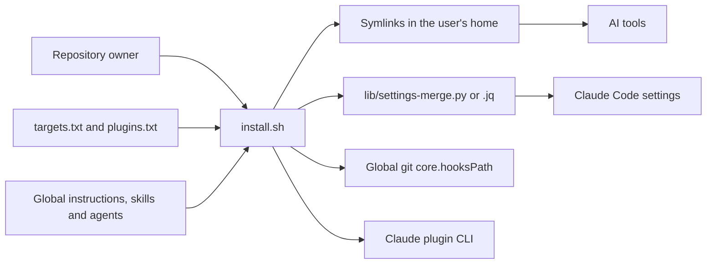
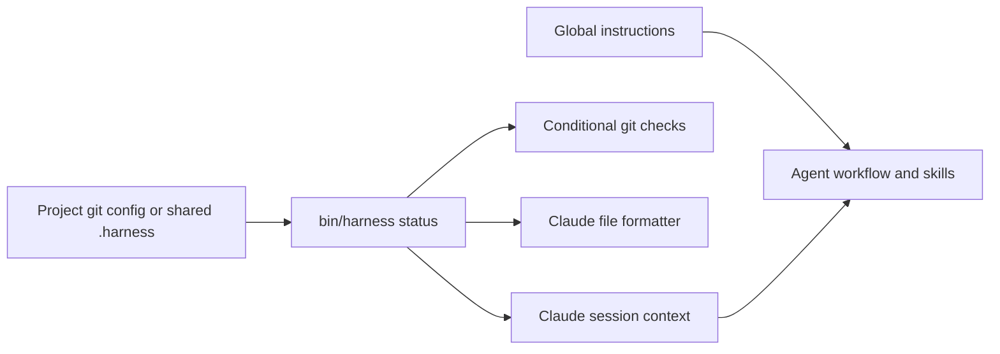

# Architecture

How the repository's components fit together, from installation to an agent session or a git operation. Supported tools and installed paths are listed in [how it works](how-it-works.md).

## Context and installation

The harness is a local collection of instructions and scripts. AI tools read its installed configuration; git and Claude Code invoke its executable hooks.

`install.sh` configures tools, links content, merges settings, installs git hooks and updates plugins in that order. It counts failures while continuing other steps, then exits non-zero if any step failed. Links point to the checkout, so its location must remain available; re-running the installer repairs links after a move.

## Components and dependency direction

| Component | Responsibility | Dependencies |
| --- | --- | --- |
| `global/AGENTS.md` | Always-on preferences and the workflow for enabled projects | Skills for detailed instructions |
| `skills/` | Task-specific procedures, references and reusable assets | Global preferences and project conventions |
| `agents/` | Role-specific instructions for planning, implementation and review | Skills; loaded as subagents by Claude Code |
| `targets.txt`, `plugins.txt` | Declare supported tools and Claude plugins | Read by the installer |
| `install.sh` | Orchestrate installation and migration | Data files, settings merge, git and Claude CLI |
| `lib/settings-merge.py`, `.jq` | Merge settings and replace harness-tagged hook groups | Python standard library or jq |
| `bin/harness` | Enable, disable and report the per-project workflow | Git repository root and configuration |
| `git-hooks/` | Check staged secrets, commit messages and pushed refs; delegate local hooks | `bin/harness`, git and `_chain` |
| `hooks/claude/` | Supply session context, assess Bash commands and format edited files | `bin/harness`; the guard also sources `lib/shell-parse.sh` |
| `tests/`, `.github/workflows/ci.yml` | Validate content and exercise installation and hooks in temporary environments | Bash, git, Python, jq and ShellCheck |
| `evals/` | Run agent scenarios, grade artifacts and transcripts, and aggregate results | Claude or Codex CLI; grading also runs `uv run pytest` |

The installer does not implement hook policy. Git hooks share only their local-hook delegation library; Claude's shell parser tokenizes commands and its guard decides what to deny or ask about.

## Project activation and sessions

`bin/harness` is the source of truth for activation. An explicit `harness.enabled=false` wins; otherwise `true` enables the workflow, followed by a shared `.harness` file. Hooks call the CLI rather than reading these markers themselves. Claude receives the status at session start; other tools follow the instructions to check it.

Instructions guide the model's workflow. Executable hooks enforce a narrower set of checks: secret scanning and attribution removal apply in every repository using the global git hooks; Conventional Commits and tag conventions depend on activation. Claude's command guard runs independently of activation, while file formatting requires an enabled project and uses its formatter configuration and executables.

## Git hook flow

Global `core.hooksPath` points to this checkout's `git-hooks/`. A repository with its own configured `core.hooksPath` uses that path instead.

| Entry point | Current execution order |
| --- | --- |
| `pre-commit` | Inspect staged paths and added lines for secrets, then invoke the local pre-commit hook |
| `commit-msg` | Remove attribution, validate the subject when enabled, then invoke the local commit-msg hook |
| `pre-push` | Buffer stdin, check protected refs and enabled tag conventions, then forward the original stdin to the local pre-push hook |
| Other hook names | Symlink to `_chain`, which delegates to the matching local hook |

`_chain` locates local hooks through git's common directory, including bare repositories and worktrees. It preserves arguments and stdin and prevents recursion through an environment flag and file-identity check. A failing local hook propagates its exit status.

## Verification and evaluations

CI runs ShellCheck and content validation on Linux, plus installer and hook tests on Linux and macOS. Tests use temporary homes and repositories so installation and git operations stay isolated.

Behaviour evaluations are a separate, manually invoked flow: `evals/run.sh` prepares a temporary scenario and captures an agent transcript; `grade.py` inspects the resulting repository and transcript and writes `metrics.json`; `report.py` aggregates those metrics. They use real model tokens and are not part of CI. Published measurements and their limits are in [results](results.md).

## Design choices

- Store shared configuration in one versioned checkout and expose it through symlinks, so edits apply locally without copying content into each tool.
- Add tool and plugin support through data files; use skills and agent files to extend procedures and roles.
- Keep project activation in one CLI and preserve always-on safety checks when the full workflow is disabled.
- Preserve independent user settings and local hook integration rather than replacing a repository's workflow wholesale.
- Keep executable scripts compatible with Bash 3.2, and provide Python and jq settings-merge implementations for portability.
