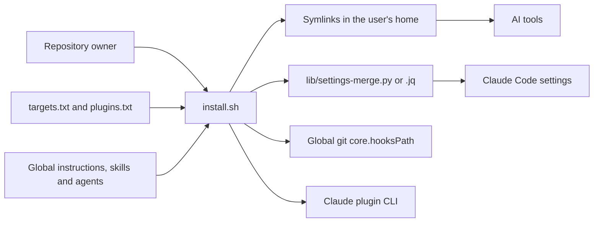
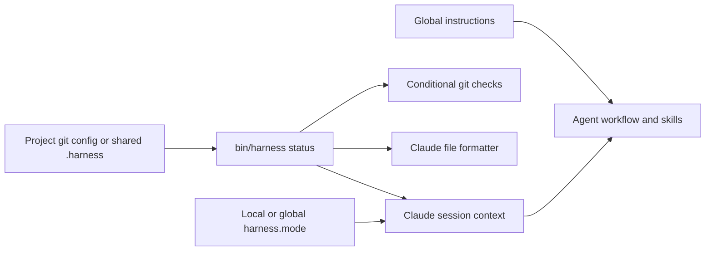

# Architecture

How the repository's components fit together, from installation to an agent session or a git operation. Supported tools and installed paths are listed in [how it works](how-it-works.md).

## Context and installation

The harness is a local collection of instructions and scripts. AI tools read its installed configuration; git and Claude Code invoke its executable hooks.

`install.sh` configures tools, links content, merges settings, installs git hooks and updates plugins in that order. It counts failures while continuing other steps, then exits non-zero if any step failed. Links point to the checkout, so its location must remain available; re-running the installer repairs links after a move.

## Components and dependency direction

| Component | Responsibility | Dependencies |
| --- | --- | --- |
| `global/AGENTS.md` | Always-on preferences and the workflow for enabled projects | Skills for detailed instructions |
| `skills/` | Task-specific procedures, references and reusable assets | Global preferences and project conventions |
| `agents/` | Role-specific instructions for planning, implementation and review | Skills; native definitions where supported, otherwise role instructions for the current runtime |
| `targets.txt`, `plugins.txt` | Declare supported tools and Claude plugins | Read by the installer |
| `install.sh` | Orchestrate installation and migration | Data files, settings merge, git and Claude CLI |
| `lib/ownership.sh`, `lib/ownership.py`, `uninstall.sh` | Record private installation ownership and restore unchanged managed state without removing project files or shared plugins | Bash records and Python standard library validation/restoration |
| `lib/doctor.sh` | Diagnose managed links, settings, ownership, Git hooks and project state without writes | Installer data, private metadata, Git and `bin/harness` queries |
| `lib/settings-merge.py`, `.jq` | Merge settings and replace harness-tagged commands while preserving user commands and group metadata | Python standard library or jq |
| `bin/harness` | Manage activation, workflow mode and local formatter trust; provide bounded startup context | Git repository root and configuration; `lib/project-context.sh` and `lib/doctor.sh` |
| `git-hooks/` | Check staged secrets, commit messages and pushed refs; delegate local hooks | `bin/harness`, git and `_chain` |
| `hooks/claude/` | Supply session context, assess Bash commands and format edited files | `bin/harness`; the guard sources `lib/shell-parse.sh`, which uses its Python parser when available |
| `tests/`, `.github/workflows/ci.yml` | Validate content and exercise installation and hooks in temporary environments | Bash, git, Python, jq and ShellCheck |
| `evals/` | Run agent scenarios, grade artifacts and transcripts, and aggregate results | Claude or Codex CLI; grading also runs `uv run pytest` |

The installer does not implement hook policy. Git hooks share only their local-hook delegation library; Claude's shell parser tokenizes commands and its guard decides what to deny or ask about.

The shell parser uses Python's standard library for bounded lexical analysis and communicates with Bash through NUL-delimited records. A conservative Bash fallback handles short commands when Python is unavailable. Unsupported executable constructs and exceeded limits request review rather than being silently skipped.

## Installation ownership and diagnostics

`install.sh --dry-run` reports intended operations without changing HOME, Git configuration, checkout permissions or plugin state. Applying changes records private versioned ownership evidence through `lib/ownership.sh`: destination, installed target/value, original state, installation-time tool declarations and physical parent path/device/inode identity. Private declaration snapshots keep historical destinations valid after customization; missing Git paths migrate only with recorded or canonical-link evidence. The first baseline survives reinstallations; already-identical legacy configuration is not newly claimed.

`uninstall.sh` delegates validation and selective restoration to `lib/ownership.py`. It checks the manifest before mutation, restores only unchanged recorded state, preserves user edits and changed parents, and retains incomplete records for retry. JSON snapshots remain local and private. It requires Python even when installation used the jq merge fallback. Neither uninstall nor doctor removes project data or invokes plugin removal.

`harness doctor` delegates to `lib/doctor.sh` and uses `targets.txt`, installed configuration and ownership metadata to diagnose managed components. Deliberate foreign Git hooks and missing optional tools are warnings; broken managed components are errors. Project checks query the CLI's existing activation/trust predicates. Diagnostics read metadata structure, not private restoration snapshot contents for display.

## Project activation and sessions

`bin/harness` is the source of truth for activation. An explicit `harness.enabled=false` wins; otherwise `true` enables the workflow, followed by a shared `.harness` file. Hooks call the CLI rather than reading these markers themselves. Formatter execution additionally requires `harness trusted --quiet`, which reads only local trust configuration. Claude receives activation, the effective mode and `harness context` excerpts at session start, and again after context compaction because the SessionStart hook has no matcher; other tools follow the instructions to run the same commands.

`harness mode` resolves the workflow mode: a local `harness.mode` wins over the global default, and a missing or invalid value means `auto`. The mode selects the `dev-workflow` level (lite, standard or strict) or, in `auto`, asks the assistant to pick one per task. Levels scale plans, handoffs, the AI log, reviews and delegation; hooks enforce the same checks at every level.

Human-readable `harness status` reports activation and local formatter trust together. Its exit code, including `--quiet`, depends only on activation. `harness trusted` and its quiet mode depend only on local trust; both commands share the same trust predicate.

`lib/project-context.sh` reads bounded excerpts of project instructions, architecture and an active handoff, without loading the full docs tree; in `lite` mode it loads only the project instructions. It has a shared byte budget and per-file line limits and skips missing files and external symlinks. `harness.context=false` disables these extra excerpts.

In enabled projects, `skills/orchestrate/` routes complex independent strict-level tasks to available models and effort settings under an approved plan; at lite and standard it only suggests delegation. `harness.delegation=off` opts out of automatic delegation; missing/auto uses it. Capability detection and sequential fallbacks avoid promises that the current runtime cannot fulfil.

Instructions guide the model's workflow. Executable hooks enforce a narrower set of checks: secret scanning and attribution removal apply in every repository using the global git hooks; Conventional Commits and tag conventions depend on activation. Claude's command guard runs independently of activation, while file formatting requires an enabled and locally trusted project.

## Git hook flow

Global `core.hooksPath` points to this checkout's `git-hooks/`. A repository with its own configured `core.hooksPath` uses that path instead.

| Entry point | Current execution order |
| --- | --- |
| `pre-commit` | Run the local hook, then inspect exact staged paths and added lines in the final index for secrets; inspection errors block the commit |
| `commit-msg` | Remove attribution, validate the subject when enabled, then invoke the local commit-msg hook |
| `pre-push` | Buffer stdin, check protected refs and enabled tag conventions, then forward the original stdin to the local pre-push hook |
| Other hook names | Symlink to `_chain`, which delegates to the matching local hook |

`_chain` locates local hooks through git's common directory, including bare repositories and worktrees. It preserves arguments and stdin and prevents recursion through an environment flag and file-identity check. A failing local hook propagates its exit status.

## Verification and evaluations

CI runs ShellCheck and content validation on Linux, plus installer and hook tests on Linux and macOS. Tests use temporary homes and repositories so installation and git operations stay isolated.

Behaviour evaluations are a separate, manually invoked flow: `evals/run.sh` prepares a temporary scenario and captures an agent transcript; `grade.py` inspects the resulting repository and transcript and writes `metrics.json`; `report.py` aggregates those metrics. They use real model tokens and are not part of CI. Published measurements and their limits are in [results](results.md).

## Design choices

- Store shared configuration in one versioned checkout and expose it through symlinks, so edits apply locally without copying content into each tool.
- Add tool and plugin support through data files; use skills and agent files to extend procedures and roles.
- Keep project activation in one CLI and preserve always-on safety checks when the full workflow is disabled.
- Preserve independent user settings and local hook integration rather than replacing a repository's workflow wholesale.
- Keep executable scripts compatible with Bash 3.2, and provide Python and jq settings-merge implementations for portability.
