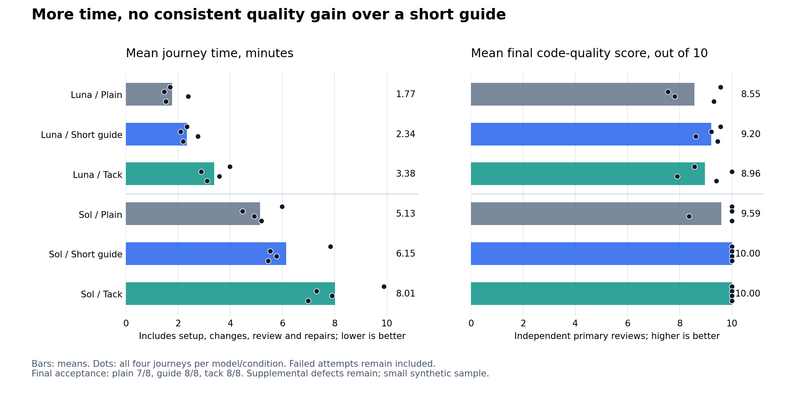

# Lifecycle value: complete deliveries, later changes and contributor setup

**Tack did not earn its extra cost against a short project guide in this study.** Both passed final acceptance in 8/8 journeys; the guide had slightly higher mean code-quality grades with Luna and tied tack with Sol. Tack took more total time in every matched comparison. Additional source review found defects beyond the frozen acceptance tests, including a valid-input rejection with tack.

All 24 scheduled journeys were collected: 97 development attempts (96 completed and one provider interruption), plus 20 completed independent reviews. There were no model retries. These results support the specific functional improvements below, not a claim that all four product goals have been achieved.



The [plot source](support/plot-lifecycle.py) reads the published facts. The following tables give exact costs, acceptance and limits.

## What this comparison measures

The four questions are whether tack avoids important defects, reduces correction or integration effort, makes a later change easier, and saves contributor setup. Extra workflow activity is a cost. Passing tests and following conventions are useful evidence, but neither alone establishes better code or a worthwhile tradeoff.

The [frozen protocol](../../evals/lifecycle-protocol.md) and [manifest](../../evals/batches/lifecycle-value.json) define 24 journeys: two implementer models, two scenarios, two repetitions and three conditions. Each journey has setup, implementation, a fresh participant's later change, and review resolution. One final correction is allowed if frozen acceptance still fails. Twenty independent code reviews assess initial/final anonymous production snapshots, including four predetermined order reversals.

| Condition | Starting point |
| --- | --- |
| Plain adoption | No tack or AGENTS.md initially; existing project facts and the working agreement are available |
| Project instructions | The same inputs plus a short conventional AGENTS.md |
| Tack | The same inputs plus the pinned tack installation and local activation; setup must create the shared configuration |

All conditions receive identical product requests, public contracts and built-in test runners. Implementation prompts do not ask for tests, TDD, SOLID, commits or modularity. The working agreement already contains engineering choices, and the setup task asks each assistant to preserve them for another participant. Plain can create its own AGENTS.md and reuse it. This measures adoption with an existing agreement, not coding with all practice guidance removed; earlier task-only comparisons remain separate.

Stock covers atomic reservations, validation, non-mutation and later partial returns. Orders covers exact integer money, shipping compatibility, frontend migration and integration of a backend branch plus another participant's label change. The local review record has two real redirect defects, an outdated line reference, an existing follow-up issue and an optional style suggestion. It does not exercise live GitHub APIs or prove fewer human review comments.

## Versions and isolation

- Product: `145f3b1b8d8d163b2713b78e3abc021028030525`; protocol commit: `b938ab6f5dc04bd10b31a5f614ffa3e7415773c7`.
- Implementers: `gpt-6-luna` and `gpt-6.1-sol`, medium effort. Independent reviewer: `gpt-6-astra`, medium effort. Codex CLI 0.160.1 through the ChatGPT subscription.
- Image: `sha256:b3595972953b86399133c40386256f2b00facc6170d9be05a70891f24615963e`. At most two simultaneous model calls, 300 seconds per development session and 180 seconds per independent review. No discarded model retries.
- Fresh participant homes; a separate clone for the later change. Controller commits transport delivered bytes, including uncommitted work, but do not earn workflow credit or prove merge readiness.
- Private graders run in separate networkless containers without credentials. Product archives exclude evaluator source, reference tests and experiment reports. Correct references pass and deliberate contract defects fail in offline tests before model calls. A fake-CLI smoke is excluded from results.

## Outcomes and costs

Each row contains four journeys: two scenarios, twice each. Quality is the primary independent review's weighted score out of 10, averaged across four initial or four final deliveries. The order-reversal checks are separate.

| Model | Condition | Final acceptance | Initial quality | Final quality | Total seconds | Input tokens | Cached input | Output tokens |
| --- | --- | --- | --- | --- | --- | --- | --- | --- |
| Luna | Plain | 3/4 | 9.325 | 8.550 | 423.803 | 2,170,499 | 1,902,080 | 33,057 |
| Luna | Project guide | 4/4 | 9.600 | 9.200 | 561.140 | 3,250,095 | 2,916,096 | 43,410 |
| Luna | Tack | 4/4 | 9.175 | 8.963 | 811.720 | 5,512,510 | 5,003,776 | 60,031 |
| Sol | Plain | 4/4 | 10.000 | 9.588 | 1,232.225 | 2,143,267 | 1,871,104 | 50,457 |
| Sol | Project guide | 4/4 | 10.000 | 10.000 | 1,475.085 | at least 2,462,824 | at least 2,161,024 | at least 48,263 |
| Sol | Tack | 4/4 | 10.000 | 10.000 | 1,922.847 | 4,309,413 | 3,723,776 | 65,909 |

Development totals include both participants' installation, setup, build, change, review resolution and any final repair. Failed attempts remain in the denominator. Independent judges and private grading are evaluation costs and remain separate. Input already includes cached input; tokens on this subscription are not dollar charges. A failed turn without reported usage has an unknown cost, not zero tokens.

Against the project guide, tack used **44.7% more time and 69.6% more input tokens with Luna**. With Sol it used **30.4% more time**; an exact full-sample token ratio is unavailable because the interrupted baseline turn omitted usage. Excluding all three conditions in that matched block gives **32.3% more time and 69.2% more input**. The conclusion does not depend on counting the outage as free work.

Against plain adoption, tack used 1.92x time and 2.54x input with Luna, and 1.56x time and 2.01x input with Sol. Luna's extra accepted delivery is a narrow benefit over plain; the cheaper project guide obtained the same acceptance outcome. A perfect frozen-test score or reviewer grade does not mean defect-free code.

### Stage costs and subsequent work

Seconds summed across the four journeys in each row:

| Model / condition | Setup and both installations | Build | Later change | Review resolution | Final repair |
| --- | --- | --- | --- | --- | --- |
| Luna / plain | 74.974 | 104.826 | 141.677 | 85.259 | 17.067 |
| Luna / project | 105.971 | 158.808 | 199.121 | 97.240 | 0 |
| Luna / tack | 227.223 | 183.862 | 256.001 | 144.634 | 0 |
| Sol / plain | 198.967 | 287.887 | 447.187 | 298.184 | 0 |
| Sol / project | 223.845 | 429.841 | 438.873 | 382.526 | 0 |
| Sol / tack | 425.140 | 421.239 | 674.652 | 401.816 | 0 |

Tack's setup cost was 2.14x the guide's with Luna and 1.90x with Sol. Later changes took 1.29x and 1.54x respectively; the latter includes the interrupted project session. There is no measured setup or maintenance-time saving here. The published facts retain each production diff's changed paths and added/removed lines. Diff size is descriptive: more or fewer lines alone do not establish maintainability, SOLID compliance or scalability.

These are different fixtures and a different comparison from the earlier 20% task-time and 30% setup-reduction targets against a previous tack version. This study does not establish those reductions and should not be pooled with that earlier experiment.

### Every matched comparison

Each cell lists **plain / project guide / tack**. Providing both repetitions shows the observed spread rather than only an aggregate. The JSON also includes per-model/per-scenario medians, ranges and cost per accepted delivery, retaining failed delivery costs.

| Model | Scenario / repetition | Total seconds | Input tokens | Final quality |
| --- | --- | --- | --- | --- |
| Luna | Orders 1 | 101.20 / 139.72 / 238.45 | 496,333 / 720,889 / 1,713,653 | 9.55 / 9.55 / 8.55 |
| Luna | Orders 2 | 143.00 / 164.77 / 214.13 | 681,736 / 1,077,026 / 1,406,634 | 7.55 / 9.20 / 10.00 |
| Luna | Stock 1 | 91.38 / 131.10 / 186.30 | 516,273 / 759,612 / 1,297,491 | 7.80 / 8.60 / 7.90 |
| Luna | Stock 2 | 88.22 / 125.55 / 172.84 | 476,157 / 692,568 / 1,094,732 | 9.30 / 9.45 / 9.40 |
| Sol | Orders 1, interrupted | 358.18 / 469.89 / 592.57 | 584,736 / at least 610,511 / 1,175,201 | 10.00 / 10.00 / 10.00 |
| Sol | Orders 2 | 295.10 / 346.47 / 473.59 | 598,052 / 670,869 / 1,124,420 | 10.00 / 10.00 / 10.00 |
| Sol | Stock 1 | 311.37 / 327.13 / 418.43 | 526,719 / 600,827 / 1,027,261 | 8.35 / 10.00 / 10.00 |
| Sol | Stock 2 | 267.58 / 331.59 / 438.26 | 433,760 / 580,617 / 982,531 | 10.00 / 10.00 / 10.00 |

## Defects, corrections and independent code review

All 24 initial implementations passed the frozen behavioral checks. The only journey requiring the allowed final repair was Luna/plain/orders 2. Its business behavior initially passed, but its own outdated tests expected the previous object shape. The repair hid `shippingCents` from enumeration to satisfy those assertions. Eight frozen checks failed as a consequence of **one underlying defect**, not eight independent bugs. A subsequent JSON round-trip probe confirmed that the field disappears in transport and the migrated consumer fails. The same probe passed on the other 11 orders deliveries. Both the guide and tack avoided this defect in the matched case.

Source review prompted these additional probes, applied to every applicable final delivery. They are **supplemental findings**, not retroactive changes to frozen acceptance:

| Delivery | Confirmed observation | Meaning |
| --- | --- | --- |
| Luna / plain / stock 1 | Invalid stock or held values with a nonempty request raise `TypeError` during comparison instead of the required `ValueError` | Validation happens too late; a caller relying on the documented error contract can fail |
| Luna / tack / stock 1 | `reserve({}, [])` and `release({}, {}, [])` reject empty dictionaries | A valid no-op input is rejected without a contract requirement |
| Luna / project / orders 2 | An explicitly `undefined` version is accepted as a legacy object | A narrow local JavaScript boundary if "missing version" means an absent property; it cannot occur in JSON and is less consequential than the transport defect |

The independent reviewer evaluated production code only: responsibilities (25%), readability (20%), robustness (20%), changeability (15%), simplicity (10%) and consistency (10%). Tests, branches and extra documents do not inflate these scores. The anonymous code and all dimension scores/findings are published in the facts JSON.

Four predetermined reversed-order triplets provide 12 repeat grades. Their mean absolute difference from the primary grades was 0.146 points, maximum 0.45; one close Luna stock ordering changed. Treat small decimal differences as uncertain, not a stable quality ranking. Sol's grades also show a ceiling effect.

The orchestrator inspected all eight primary final code bundles and saved its qualitative assessment before opening their label mapping. It agreed that the strongest Sol deliveries were largely equivalent. In Luna/orders 1, tack added descriptor-only restrictions, a pass-through helper and repeated validation without a stated need. In Luna/orders 2, tack was the clearest complete implementation. In Luna/stock 1, the brief guide had the strongest validation structure. There is no consistent tack advantage or evidence of better large-system scalability.

One reviewer penalized Sol/plain/stock 1 for rejecting double slashes anywhere in a redirect. The public wording is ambiguous about interior slashes. Its original score is retained, but the orchestrator does **not** treat that finding as a confirmed important defect or use it to claim a Sol quality gain.

The 20 independent reviews used 977.559 model seconds, 849,426 input tokens (438,656 cached within that input) and 31,859 output tokens. This is the experiment's evaluation cost, separate from the development totals and their review-resolution stage.

## Engineering practices and onboarding

| Model / condition | Initial tests reject the original implementation | Sessions with new Conventional Commits | Non-setup sessions with explicit check commands |
| --- | --- | --- | --- |
| Luna / plain | 3/4 | 0/17 | 7/13 |
| Luna / project | 4/4 | 1/16 | 11/12 |
| Luna / tack | 4/4 | 16/16 | 12/12 |
| Sol / plain | 4/4 | 5/16 | 12/12 |
| Sol / project | 4/4 | 16/16 | 12/12 |
| Sol / tack | 4/4 | 16/16 | 12/12 |

Commit counts exclude controller snapshots and commits imported from a previous participant. No AI attribution was found in the inspected commit history in any of the 97 stage snapshots. End-of-stage branches can be inherited from the controller and are not proof of deliberate branch creation. Explicit check commands are observable evidence; hook-triggered checks may not appear separately. The original-implementation probe demonstrates some useful coverage, not exhaustive edge coverage or universal TDD.

Trace inspection found genuine assertion failure, implementation and passing rerun sequences in plain and project conditions too. Several tack sessions edited tests first without an observable failing behavioral run. A syntax failure after editing production code is not red/green evidence. **This collection does not establish consistent TDD**, and conventional history alone does not prove better engineering. All 24 journeys resolved the local review dispositions and reused the existing follow-up; none of the conditions demonstrated an advantage on that fixture.

All eight tack setups recorded choices, enabled shared activation and saved the three agreed context paths. Every fresh clone remained untrusted until the controller explicitly granted local trust. However, Luna configured the two team orders projects as `solo`, omitted explicit shared reply/commit values in those runs, and omitted the explicit shared commit value in stock 2. One setup also created a duplicate default architecture document. All four Sol setups saved the six inspected choices explicitly and correctly. Configuration transfer is working; reliable configuration by every assistant is not assured.

Because the experiment supplied the choices, there were no human clarification conversations to count. Saved files and local trust isolation do not by themselves demonstrate faster human onboarding.

## Collection limits and corrections

The first Sol/project orders change was interrupted by a provider capacity error. The runner retained it but did not classify that turn failure as a controller infrastructure exception, so scheduled work continued. There was no retry or model substitution. Report its time and missing usage, retain the complete journey, and show sensitivity with the entire affected matched block excluded. This outage is not a code-quality defect caused by a condition.

The original interruption took 100.021 seconds and reported no terminal usage. The tables include that time and mark affected token totals as lower bounds. With the whole Sol/orders 1 block excluded, tack/plain ratios are 1.52x time and 2.01x input; tack/project ratios are 1.32x time and 1.69x input. A post-collection controller fix now preserves a provider-failed attempt and stops unscheduled work, including later stages of an active peer. It did not change these frozen runs.

A read-only archive audit found evaluator source and reference tests in the older value-first product archives. No read of that grader was found in their eight command transcripts, but the archives did not provide the isolation previously implied. Those original reports and raw evidence remain unchanged. This batch uses explicit archive exclusions and independent grader containers.

After collection, the older quality/value runners were moved to the same checked archive helper, with a regression test against a real Git archive. This fixes future isolation; it cannot retroactively strengthen old results. Token reporting also reconciles the journey ledger against original transcripts, and distinguishes new actor commits from transported history.

These are small synthetic applications with two repetitions, supplied choices and no clarification dialogue. They cannot establish human onboarding savings, large-system scalability or general causal effects. Wall time includes service latency. The orchestrator saw labeled runtime and acceptance information during collection; its assessment is not fully blinded. Independent reviewers receive only anonymous production code, requirements and scope, without tests, workflow artifacts, costs or labels.

## Decision against the four goals

| Goal | What the evidence supports | Decision |
| --- | --- | --- |
| Avoid consequential defects cheaper alternatives miss | Tack avoided one plain delivery's serialization defect, as did the brief guide; tack also rejected a valid stock input | No general advantage over the guide established |
| Reduce correction, review and integration effort | One plain repair failed; both alternatives needed no repair. Review dispositions tied and tack's total/review time rose | Narrow gain over one plain case; no lifecycle saving over the guide |
| Make later changes easier | Similar Sol code; mixed Luna designs; tack's later changes took longer with both models | Goal not achieved in this sample |
| Save teammate configuration and orientation | Shared paths transferred and trust stayed local; several Luna choices were wrong or implicit; setup took longer | Functional transfer works; time saving and reliable adoption not established |

For these fixtures, paying more for tack than for the brief guide is **not justified by the observed outcomes**. Do not rationalize the difference as scalability or unseen human savings. Prefer existing project facts and checks when they suffice. Keep additional capabilities only where a project can demonstrate a concrete benefit, such as a real clean-clone check, a useful contract test or shared preferences across tools.

The product changes do close specific functional gaps: `verify --all` can find a committed defect in a clean checkout, and startup recognizes recorded shared choices without sharing local execution trust. Regression tests establish those behaviors. Whether assistants use them correctly or save time is a separate measured question.

After examining the deliveries, the focused contract guide now explicitly includes transport serialization and updating stale assertions instead of hiding fields to appease them. That is a small response to an observed need, not a measured improvement of the frozen candidate. No additional mandatory review pass, service or new agent was added to justify an already expensive workflow.

The next useful evidence would come from a real project's existing contracts and contributor friction, with the brief guide retained as a baseline. This report does not claim that another generic synthetic batch or more instructions will fix the gap.

## Evidence

- [Machine-readable facts](2026-10-08-lifecycle-value-facts.json): all 24 journeys, failures, stage costs, setup observations, workflow evidence, production-change sizes, every anonymous code bundle, review findings, supplemental probe code/results and source hashes.
- [Orchestrator assessment](2026-10-08-lifecycle-value-orchestrator.json): sealed qualitative notes for all eight primary final bundles, with prior-knowledge limits. SHA-256: `f573b2afd06657210d7961cecf89eef98d502a91e7f855d0df86976c0a4a9a80`.
- [Implementation record](../archive/plans/2026-10-08-lifecycle-value-implementation.md), [protocol](../../evals/lifecycle-protocol.md), [manifest](../../evals/batches/lifecycle-value.json) and [publisher](support/summarize-lifecycle.py).

Raw collection and review evidence remain locally under ignored `evals/out/lifecycle-20261008/` and `evals/out/lifecycle-reviews-20261008/`. The sealed `raw-evidence.tar.gz` contains 2,458 files, 2,035,059 compressed bytes. SHA-256: `7bda24dde542135b870f68837fc6cf4dfd1866679d874fcd1a2ddf7caf765250`; its file index SHA-256 is `368a00a3ad5acc292ba2aadd816460dd04ab6e300ebd5d38cd856988b704564b`. This archive is retained locally, not a public download. It excludes credentials, participant homes, Git internals and the product tar. The public JSON provides reviewable code and outcomes without publishing those private runtime directories.

Rebuild the public facts from retained raw evidence:

```bash
python3 docs/benchmarks/support/summarize-lifecycle.py \
  evals/out/lifecycle-20261008 evals/out/lifecycle-reviews-20261008 \
  --output docs/benchmarks/2026-10-08-lifecycle-value-facts.json
```
