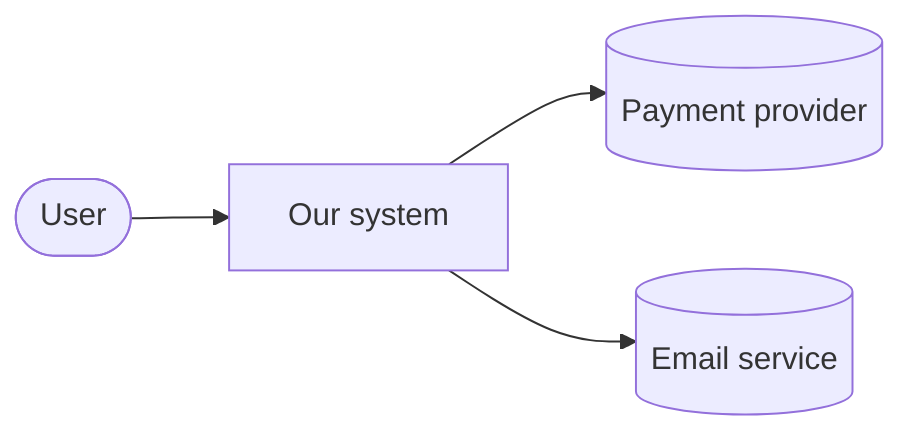
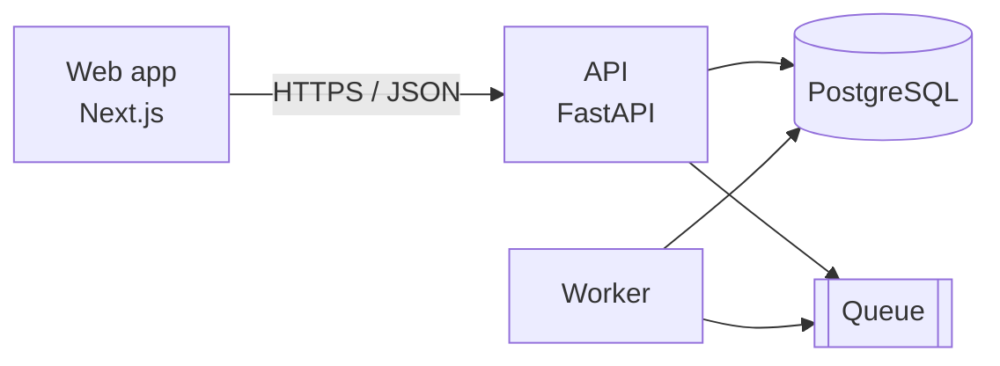
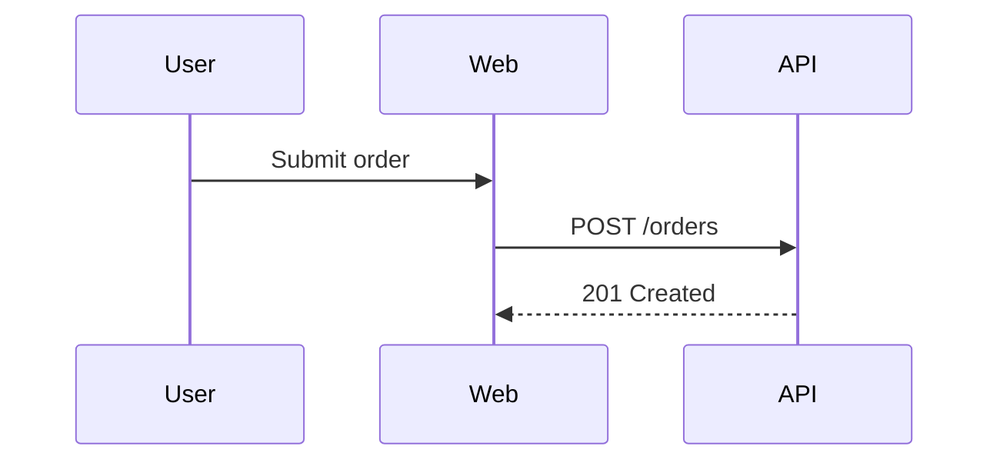

# Architecture

How the system is put together and why. Decisions in detail: [adr/](adr/).

## Context

## Containers

## Components
| Component | Responsibility | Technology | Code |
| --- | --- | --- | --- |
| Web app | | | `apps/web/` |
| API | | | `apps/api/` |

## Key flows
Only flows that are hard to follow in the code. One sequence diagram each.

## Decisions
- [ADR-0001](adr/0001-record-architecture-decisions.md): …
